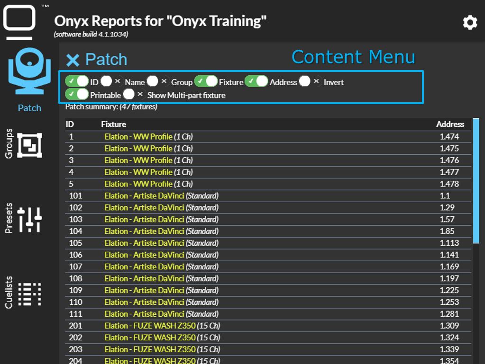

# Onyx Report Reader

Onyx Report Reader is an offline application which doesn't need any Internet Connection (except for the first time of course!)

Onyx Report Reader allows you to display, filtered and print easily your Onyx Patch, Fixture Group, Preset Report & Cuelist Report.

## Data Disclaimer

All data you will upload to Onyx Report Reader are stored locally in your navigator (through localstorage & Indexeddb database) and are not pushed to any server.

## Installation as an APP

Onyx Report Reader is a PWA (Progressive Web App) which allow you to install it locally as an application.

### Desktop with Chrome

Visit the website http://report.onyxfixturefinder.com, then open your Chrome Menu (on top right), then select "Install Onyx Report Reader".

More general detail available there https://love2dev.com/blog/chrome-desktop-pwa/

### Mobile with Chrome

Visit the website http://report.onyxfixturefinder.com. A notification will pop-up at the bottom of the page to allow you to install this application.

## Layout

### Empty Interface (no report loaded)

Onyx Report Reader is split in 4 parts:

### Loaded Interface (all reports loaded)

Once report are loaded, the active page has the icon colored, and other icon with report loaded are colored in white (instead of grey)

#### Content menu

You can customize the content display by clicking on the "Content Menu Icon"

* First line is table customisation (hide/show of column)
* Second line is other options

"Printable" option allow you to hide the report when printing

#### Empty Report

Onyx Report Reader keep your preferences and loaded report(s), even after a refresh, it will recompute reports.

Click on the menu to display the different reset action.
* Reset all reports (Patch always reset all)
* Reset Groups report
* Reset Presets report
* Reset Cuelists report
* Reset user preferences (option & hide/show)
